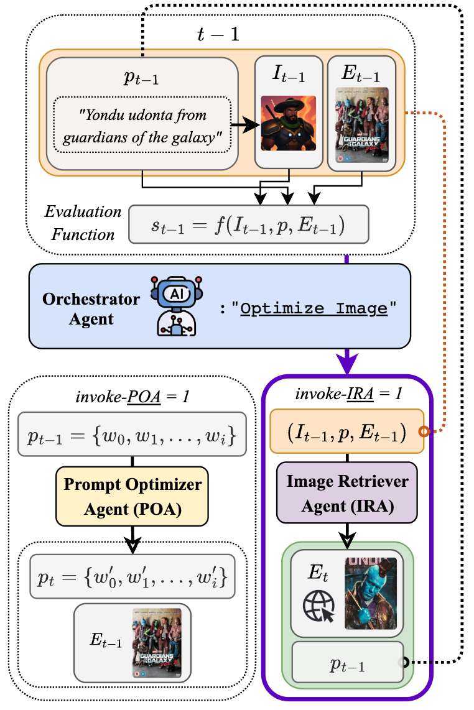

# WORLD-TO-IMAGE: GROUNDING TEXT-TO-IMAGE GENERATION WITH AGENT-DRIVEN WORLD KNOWLEDGE

This is the official repository of "[WORLD-TO-IMAGE: GROUNDING TEXT-TO-IMAGE GENERATION WITH AGENT-DRIVEN WORLD KNOWLEDGE](https://arxiv.org/abs/2510.04201)"
> **WORLD-TO-IMAGE: GROUNDING TEXT-TO-IMAGE GENERATION WITH AGENT-DRIVEN WORLD KNOWLEDGE** <br>
> [Moo Hyun (Kyle) Son](mailto:mhson@cse.ust.hk)<sup>1</sup>, [Jintaek Oh](mailto:johaa@connect.ust.hk)<sup>1</sup>, [Sun Bin Mun](mailto:smun6@gatech.edu)<sup>2</sup>, [Jaechul Roh](mailto:jroh@cs.umass.edu)<sup>3</sup>, [Sehyun Choi](mailto:schoiaj98@gmail.com)<sup>4</sup> <br>
> <sup>1</sup>The Hong Kong University of Science and Technology (HKUST)&nbsp;&nbsp;<sup>2</sup>Georgia Institute of Technology&nbsp;&nbsp;<sup>3</sup>University of Massachusetts Amherst&nbsp;&nbsp;<sup>4</sup>Twelve Labs <br>
>
> **Abstract.** While text-to-image (T2I) models can synthesize high-quality images, their performance degrades significantly when prompted with novel or out-of-distribution (OOD) entities due to inherent knowledge cutoffs. We introduce <span style="font-variant: small-caps;">World-To-Image</span>, a novel framework that bridges this gap by empowering T2I generation with agent-driven world knowledge. We design an agent that dynamically searches the web to retrieve images for concepts unknown to the base model. This information is then used to perform multimodal prompt optimization, steering powerful generative backbones toward an accurate synthesis. Critically, our evaluation goes beyond traditional metrics, utilizing modern assessments like LLMGrader and ImageReward to measure true semantic fidelity. Our experiments show that <span style="font-variant: small-caps;">World-To-Image</span> substantially outperforms state-of-the-art methods in both semantic alignment and visual aesthetics, achieving **+8.1\%** improvement in accuracy-to-prompt on our curated NICE benchmark. Our framework achieves these results with high efficiency in less than three iterations, paving the way for T2I systems that can better reflect the ever-changing real world.

[Paper](https://arxiv.org/abs/2510.04201) · [Code](https://github.com/mhson-kyle/World-To-Image)

<div align="center">
  
</div>
<div align="center">
  
</div>
<div align="center">
  
</div>


## Component Details

1. **Prompt Optimizer**: LLM-based prompt optimization
2. **Image Retriever**: LLM-based image retrieval
3. **Scorer**: Scoring of the generated image
4. **Orchestrator**: Orchestrates the entire optimization workflow
5. **Pipeline**: Orchestrates the entire optimization workflow

## Dataset
You may access the NICE Benchmark dataset through the following code:
```python
from datasets import load_dataset  
dataset = load_dataset("mhsonkyle/NICE")
```

## Installation

### Prerequisites
- Python 3.10

### Install with uv (Recommended)
```bash
# Clone the repository
git clone https://github.com/mhson-kyle/World-To-Image.git
cd World-To-Image

# Install with uv
uv sync

# Activate virtual environment
source .venv/bin/activate
```

## Configuration
### OmniGen2
To use OmniGen2,
please follow the instructions in https://github.com/VectorSpaceLab/OmniGen2/ to install OmniGen2.

### Environment Variables
```bash
# Azure OpenAI
export AZURE_API_KEY="your-azure-api-key"
export AZURE_API_BASE="https://your-endpoint.openai.azure.com/"
export AZURE_API_VERSION="2024-12-01-preview"
export RAPIDAPI_KEY="your-rapidapi-key"
```

## Quick Start

### Basic Optimization
```bash
# Single prompt optimization
python run_single.py 'dr strange' --iterations 3

# Multiple prompts optimization
python run.py \
  --config configs/config_base.yaml \
```

## Citation
If you find this repository useful, please consider citing:

``` bibtex
@article{Son2025World2Image,
  title={WORLD-TO-IMAGE: Grounding Text-to-image Generation with Agent-driven World Knowledge},
  author={Son, Moo Hyun and Oh Jintaek and Mun, Sun Bin and Roh, Jaechul and Choi, Sehyun},
  archivePrefix={arXiv},
  eprint={2510.04201},
  year={2025},
  url={http://arxiv.org/abs/2510.04201},
}
```
